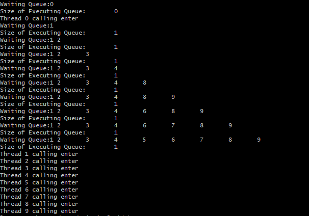

# PriorityLock

### run the program by
```sh
g++ -pthread test.c -o test
./test
```

### test
In the test file, we create 10 thread. And for each assign with a distinct priority level, ranging from 0 to 9.

By running the program, the result shows as below:

<div align="center"></div>
<div align="center">fig1: test result</div>
